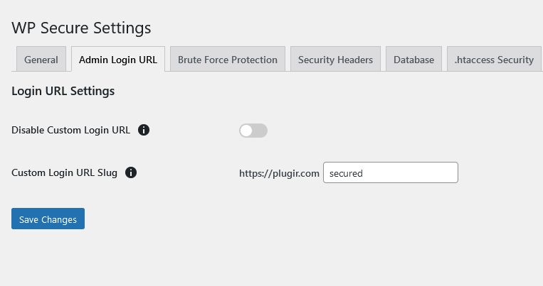

The **Admin Login URL** tab allows you to customize the login URL for your WordPress site. This feature can help prevent automated attacks targeting the default login URL (`wp-admin`). Below are the descriptions, advantages, and disadvantages of each option:

### Disable Custom Login URL
- **Description**: Disables the custom login URL feature, reverting to the default WordPress login URL.
- **Advantages**:
  - Simple and straightforward; uses WordPress's default settings.
- **Disadvantages**:
  - The default login URL (`wp-admin`) is commonly known and often targeted by automated attacks.

### Custom Login URL Slug
- **Description**: Allows you to set a custom URL slug for the login page. The URL slug is the part of the URL that comes after the domain name. For example, if you set the slug to `secured`, the login URL will be `http://example.com/secured`.
- **Advantages**:
  - Enhances security by making the login page harder to find for unauthorized users.
  - Reduces the risk of automated attacks targeting the login URL.
- **Disadvantages**:
  - If forgotten, the custom login URL may prevent legitimate users from accessing the login page. Make sure to note down the new login URL after changing it.

### Example Configuration

- **Disable Custom Login URL**: Toggle this option to enable or disable the custom login URL feature.

- **Custom Login URL Slug**: Enter the desired URL slug for the login page.
  - Example: If you set the slug to `secured`, your new login URL will be `http://example.com/secured`.
 

### Tips for Using Custom Login URL
- Ensure the custom login URL slug does not conflict with existing pages or posts on your site.
- Notify your site administrators and users about the new login URL to prevent confusion.
- Consider using a secure, hard-to-guess slug to maximize security benefits.

By customizing the login URL, you can add an extra layer of security to your WordPress site, making it more difficult for unauthorized users and automated bots to locate the login page.
