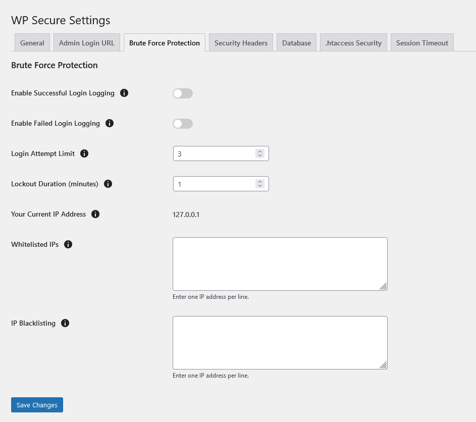

The **Brute Force Protection** tab allows you to configure various settings to protect your WordPress site from brute force attacks. Below are the descriptions, advantages, and disadvantages of each option:

### Enable Successful Login Logging
- **Description**: Logs all successful login attempts for monitoring purposes.
- **Advantages**:
  - Helps in tracking login activity and identifying any unauthorized access.
- **Disadvantages**:
  - Storing too many logs can consume database space.

### Enable Failed Login Logging
- **Description**: Logs all failed login attempts to identify potential security threats.
- **Advantages**:
  - Helps in detecting brute force attacks and taking preventive measures.
- **Disadvantages**:
  - Storing too many logs can consume database space.

### Login Attempt Limit
- **Description**: Limits the number of login attempts to prevent brute force attacks. If the limit is exceeded, the user is temporarily locked out.
- **Advantages**:
  - Prevents automated scripts from repeatedly trying to guess passwords.
- **Disadvantages**:
  - May temporarily lock out legitimate users who forget their passwords.

### Lockout Duration (minutes)
- **Description**: Specifies the duration (in minutes) for which a user is locked out after exceeding the login attempt limit.
- **Advantages**:
  - Provides a cooldown period, reducing the risk of repeated brute force attempts.
- **Disadvantages**:
  - Legitimate users may need to wait before they can attempt to log in again.

### Your Current IP Address
- **Description**: Displays the current IP address of the user accessing the settings.
- **Advantages**:
  - Helps in identifying the current IP address for whitelisting purposes.
- **Disadvantages**:
  - None.

### Whitelisted IPs
- **Description**: Allows you to specify IP addresses that are exempt from login attempt limits. Enter one IP address per line.
- **Advantages**:
  - Ensures that trusted IP addresses are not locked out, even if they exceed the login attempt limit.
- **Disadvantages**:
  - A compromised whitelisted IP can bypass brute force protection.

### IP Blacklisting
- **Description**: Allows you to specify IP addresses that are blocked from accessing the site. Enter one IP address per line.
- **Advantages**:
  - Prevents known malicious IP addresses from attempting to log in.
- **Disadvantages**:
  - A legitimate user using a blacklisted IP address will be unable to access the site.

### Example Configuration

- **Enable Successful Login Logging**: Toggle this option to enable or disable logging of successful login attempts.

- **Enable Failed Login Logging**: Toggle this option to enable or disable logging of failed login attempts.

- **Login Attempt Limit**: Set the maximum number of allowed login attempts before locking out the user.

- **Lockout Duration (minutes)**: Set the duration for which the user is locked out after exceeding the login attempt limit.

- **Your Current IP Address**: Displays the current IP address.

- **Whitelisted IPs**: Enter IP addresses to whitelist, one per line.

- **IP Blacklisting**: Enter IP addresses to blacklist, one per line.

### Tips for Brute Force Protection
- Regularly monitor login logs to identify any suspicious activity.
- Use strong, unique passwords for all user accounts.
- Whitelist trusted IP addresses to ensure they are not accidentally locked out.

By configuring these settings, you can significantly enhance the security of your WordPress site against brute force attacks.
