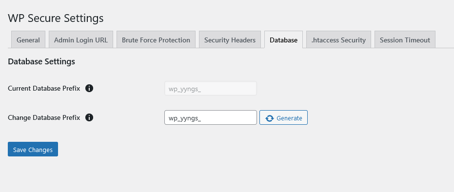

The **Database Settings** tab allows you to view and change the prefix of your WordPress database tables. Here is a detailed description of each setting:

### Current Database Prefix
- **Description**: This field displays your current database prefix.
- **Advantages**: 
  - Provides quick reference to the current database prefix.
- **Disadvantages**: 
  - None, as it is a read-only field for informational purposes.

### Change Database Prefix
- **Description**: Allows you to set a new prefix for your database tables. Use only letters, numbers, and underscores.
- **Advantages**: 
  - Changing the database prefix can add an extra layer of security by making it harder for attackers to predict table names.
- **Disadvantages**: 
  - Changing the database prefix can be risky if not done properly, as it may break the connection between WordPress and the database tables.
  
#### How to Change the Database Prefix
1. **Enter a New Prefix**: In the "Change Database Prefix" field, enter a new prefix for your database tables. The prefix should consist only of letters, numbers, and underscores.
2. **Generate Prefix**: 
   - Click the **Generate** button to create a random prefix. This button helps in generating a unique prefix, making it more difficult for attackers to guess.
   - The generated prefix will automatically be populated in the "Change Database Prefix" field.
3. **Save Changes**: Click the **Save Changes** button to apply the new prefix. 

:::danger[Important]
Always take a backup of your database before making any changes to the database prefix. This precaution ensures that you can restore your site to its previous state if something goes wrong during the prefix change process.
:::

:::tip[Tip]
Regularly changing your database prefix, along with other security practices, can significantly enhance the security of your WordPress site.
:::

