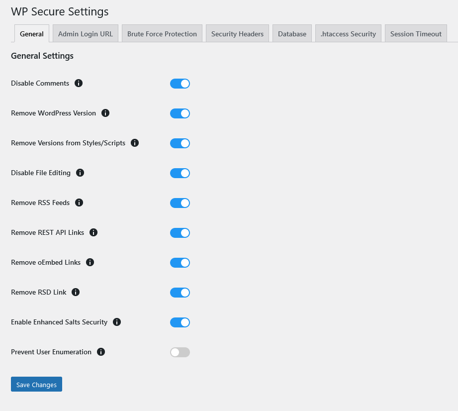

The **General Settings** tab provides various options to enhance the security of your WordPress site. Below are the descriptions, advantages, and disadvantages of each option:

### Disable Comments
- **Description**: Disables the commenting feature on your WordPress site.
- **Advantages**:
  - Reduces spam and potential malicious comments.
  - Simplifies content management for sites not requiring user comments.
- **Disadvantages**:
  - Limits user interaction and engagement.
  - Reduces feedback and discussion opportunities.

### Remove WordPress Version
- **Description**: Removes the WordPress version number from your site's HTML source code.
- **Advantages**:
  - Prevents attackers from identifying the exact WordPress version, reducing the risk of targeted attacks.
- **Disadvantages**:
  - None, as this does not affect the site's functionality.

### Remove Versions from Styles/Scripts
- **Description**: Removes version query strings from your site's stylesheets and scripts.
- **Advantages**:
  - Enhances security by obscuring the versions of scripts and stylesheets.
  - May improve caching efficiency.
- **Disadvantages**:
  - None, as this does not affect the site's functionality.

### Disable File Editing
- **Description**: Disables the built-in file editor in WordPress, preventing changes to theme and plugin files from the admin panel.
- **Advantages**:
  - Reduces the risk of unauthorized file modifications if an admin account is compromised.
- **Disadvantages**:
  - Admins need to use FTP or hosting control panel for file edits, which can be less convenient.

### Remove RSS Feeds
- **Description**: Disables RSS feeds on your site.
- **Advantages**:
  - Reduces the risk of content scraping and spam.
  - Enhances privacy by limiting public access to content feeds.
- **Disadvantages**:
  - Users can't subscribe to your site's content updates via RSS.
  - Reduces exposure to readers who use RSS feed readers.

### Remove REST API Links
- **Description**: Disables the REST API links from the site's HTML headers.
- **Advantages**:
  - Reduces the attack surface by limiting access to REST API endpoints.
  - Enhances privacy and security.
- **Disadvantages**:
  - May affect plugins and themes that rely on REST API functionality.

### Remove oEmbed Links
- **Description**: Disables oEmbed links in the site's HTML headers.
- **Advantages**:
  - Reduces unnecessary links in the HTML source.
  - Enhances privacy and security.
- **Disadvantages**:
  - Limits automatic embedding of content from external sites.

### Remove RSD Link
- **Description**: Removes the Really Simple Discovery (RSD) link from the site's HTML headers.
- **Advantages**:
  - Reduces unnecessary links in the HTML source.
  - Enhances privacy and security.
- **Disadvantages**:
  - Limits discovery capabilities for remote editing services.

### Enable Enhanced Salts Security
- **Description**: Adds additional security to WordPress salts by updating them regularly.
- **Advantages**:
  - Enhances password security by making it harder for attackers to crack hashed passwords.
- **Disadvantages**:
  - May require more frequent logins by users after salts are updated.

### Prevent User Enumeration
- **Description**: Blocks attempts to enumerate usernames through the author archive pages.
- **Advantages**:
  - Protects against attackers trying to identify valid usernames for brute force attacks.
- **Disadvantages**:
  - None, as this does not affect the site's functionality.

