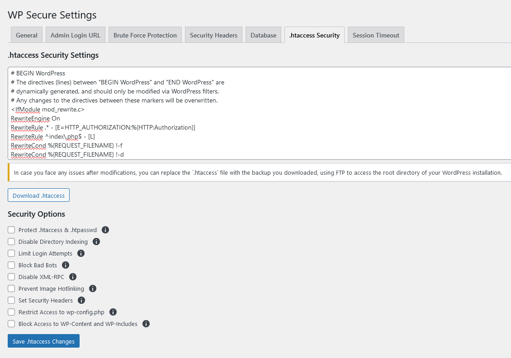

The **.htaccess Security Settings** tab allows you to add various security enhancements to your WordPress site via the .htaccess file. This file is crucial for server configurations and can significantly enhance the security of your website. Below is a detailed description of each feature available in this tab:



### Download .htaccess
- **Description**: This button allows you to download the current .htaccess file.
- **Tip**: Always download a backup of your .htaccess file before making any changes. This ensures you can restore the original configuration if something goes wrong.
- **Recovery**: If you encounter any issues after modifying the .htaccess file, replace it with the backup using FTP to access the root directory of your WordPress installation.

### Security Options
Each option below adds specific security rules to your .htaccess file. 

#### Protect .htaccess & .htpasswd
- **Description**: Denies access to `.htaccess` and `.htpasswd` files.
- **Advantages**: 
  - Prevents attackers from viewing or modifying these critical files.
- **Disadvantages**: 
  - None, as it enhances security without impacting site functionality.

#### Disable Directory Indexing
- **Description**: Prevents directory listing if no index file is present.
- **Advantages**: 
  - Hides the contents of directories, preventing attackers from browsing through them.
- **Disadvantages**: 
  - None, as it does not affect normal site operations.

#### Limit Login Attempts
- **Description**: Restricts the number of login attempts to prevent brute force attacks.
- **Advantages**: 
  - Thwarts automated attacks by limiting the number of login attempts.
- **Disadvantages**: 
  - Legitimate users may need to wait if they exceed the limit.

#### Block Bad Bots
- **Description**: Blocks known bad bots from accessing the site.
- **Advantages**: 
  - Reduces server load and prevents malicious activities.
- **Disadvantages**: 
  - May require updates to the list of blocked bots.

#### Disable XML-RPC
- **Description**: Disables XML-RPC functionality to prevent attacks.
- **Advantages**: 
  - Prevents XML-RPC-related attacks, such as brute force and DDoS.
- **Disadvantages**: 
  - Disables remote publishing and certain plugins that rely on XML-RPC.

#### Prevent Image Hotlinking
- **Description**: Stops other sites from displaying your images. Update `yourwebsite.com` accordingly.
- **Advantages**: 
  - Prevents unauthorized use of your images, saving bandwidth.
- **Disadvantages**: 
  - Requires updating the rule if your domain changes.

#### Set Security Headers
- **Description**: Adds security headers to protect against various attacks.
- **Advantages**: 
  - Enhances security by setting headers like Content-Security-Policy, X-Content-Type-Options, X-Frame-Options, X-XSS-Protection, etc.
- **Disadvantages**: 
  - Incorrect settings can break site functionality.

#### Restrict Access to wp-config.php
- **Description**: Denies access to `wp-config.php` for added security.
- **Advantages**: 
  - Protects sensitive configuration details from being accessed.
- **Disadvantages**: 
  - None, as it enhances security without impacting site functionality.

#### Block Access to WP-Content and WP-Includes
- **Description**: Restricts access to sensitive directories.
- **Advantages**: 
  - Prevents unauthorized access to critical WordPress directories.
- **Disadvantages**: 
  - May require adjustments if legitimate users or services need access.

### How to Replace the .htaccess File if Issues Occur
If you face any issues after modifications, you can replace the `.htaccess` file with the backup you downloaded. Use FTP to access the root directory of your WordPress installation and replace the existing `.htaccess` file with the backup.

### Example .htaccess Security Rules
Below are some example rules for each security option. These will be added to your .htaccess file when you enable the respective options:

- **Protect .htaccess & .htpasswd**
```apache
<FilesMatch "^\.ht">
    Require all denied
</FilesMatch>
```

- **Disable Directory Indexing**

```apache
Options -Indexes
```

- **Limit Login Attempts**

```apache
<IfModule mod_rewrite.c>
    RewriteEngine On
    RewriteBase /
    RewriteCond %{REQUEST_METHOD} POST
    RewriteCond %{REQUEST_URI} .(wp-login\.php|xmlrpc\.php)
    RewriteCond %{REMOTE_ADDR} !^YOUR.IP.ADDRESS$
    RewriteCond %{REQUEST_URI} !^/(.*)$ [NC]
    RewriteRule ^(.*)$ - [F]
</IfModule>
```
- **Block Bad Bots**

```apache
SetEnvIfNoCase User-Agent "BadBot" bad_bot
<Limit GET POST HEAD>
    Order Allow,Deny
    Allow from all
    Deny from env=bad_bot
</Limit>
```
- **Disable XML-RPC**

```apache
<Files xmlrpc.php>
    Order allow,deny
    Deny from all
</Files>
```
- **Prevent Image Hotlinking**

```apache
RewriteEngine On
RewriteCond %{HTTP_REFERER} !^$
RewriteCond %{HTTP_REFERER} !^http(s)?://(www\.)?yourwebsite\.com [NC]
RewriteRule \.(jpg|jpeg|png|gif)$ - [F]
```
- **Set Security Headers**

```apache
Header set Content-Security-Policy "default-src 'self';"
Header set X-Content-Type-Options "nosniff"
Header set X-Frame-Options "SAMEORIGIN"
Header set X-XSS-Protection "1; mode=block"
```
- **Restrict Access to wp-config.php**

```apache
<Files wp-config.php>
    Order allow,deny
    Deny from all
</Files>
```
- **Block Access to WP-Content and WP-Includes**

```apache
<IfModule mod_rewrite.c>
    RewriteEngine On
    RewriteBase /
    RewriteRule ^wp-admin/includes/ - [F]
    RewriteRule !^wp-includes/ - [S=3]
    RewriteRule ^wp-includes/[^/]+\.php$ - [F]
    RewriteRule ^wp-includes/js/tinymce/langs/.+\.php - [F]
    RewriteRule ^wp-includes/theme-compat/ - [F]
</IfModule>
```

:::tip[Pro Tip]
Always download a backup of your .htaccess file before making any changes. This ensures you can restore the original configuration if something goes wrong.
:::


:::danger[Warning]
If you encounter any issues after modifying the .htaccess file, replace it with the backup using FTP to access the root directory of your WordPress installation.
:::