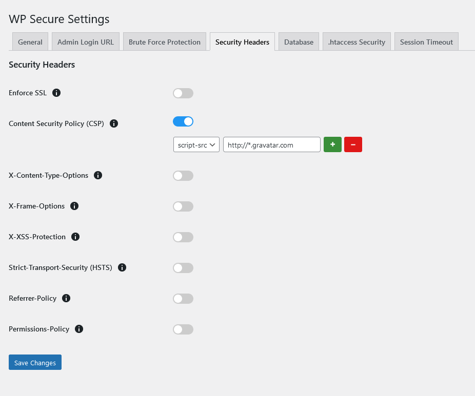

The **Security Headers** tab allows you to set various HTTP security headers to help protect your site. Here is a detailed description of each setting:

### Enforce SSL
- **Description**: Forces all traffic to use HTTPS.
- **Advantages**: 
  - Ensures secure communication between the server and clients.
  - Helps protect sensitive data during transmission.
- **Disadvantages**: 
  - Requires a valid SSL certificate.
  - May require additional configuration for proper setup.

### Content Security Policy (CSP)
- **Description**: Controls which resources can be loaded. Adjust according to site needs.
- **Advantages**: 
  - Helps prevent Cross-Site Scripting (XSS) attacks by specifying allowed content sources.
  - Can mitigate other types of attacks such as data injection.
- **Disadvantages**: 
  - Requires careful configuration to avoid breaking site functionality.
  - May require ongoing maintenance as site resources change.

#### How to Configure CSP
Content Security Policy (CSP) is a powerful tool to mitigate XSS attacks by specifying which sources of content are allowed to be loaded. The following steps outline how to add different CSP directives:

1. **Enable CSP**: Toggle the "Content Security Policy (CSP)" switch to enable CSP.

2. **Add CSP Directives**:
   - **Select Directive Type**: Choose a directive type from the dropdown menu. Common directives include:
     - `default-src`: Default policy for fetching resources such as scripts, images, styles, etc.
     - `script-src`: Defines valid sources for JavaScript.
     - `style-src`: Defines valid sources for CSS.
     - `img-src`: Defines valid sources for images.
     - `font-src`: Defines valid sources for fonts.

   - **Enter URL or Source**: Enter the URL or source for the selected directive. For example:
     - `'self'`: Refers to the same origin as the document.
     - `https://example.com`: Allows content to be loaded from `example.com`.
     - `data:`: Allows loading of resources from data URIs (e.g., for inline images).

   - **Add Directive**: Click the `+` button to add the directive. 

3. **Example Configurations**:
   - **Allow scripts from the same origin and a specific CDN**:
     - `script-src 'self' https://cdn.example.com`
   - **Allow styles from the same origin and a specific CDN**:
     - `style-src 'self' https://cdn.example.com`
   - **Allow images from the same origin, data URIs, and Gravatar**:
     - `img-src 'self' data: https://*.gravatar.com`
   - **Allow fonts from the same origin and data URIs**:
     - `font-src 'self' data:`

### X-Content-Type-Options
- **Description**: Prevents browsers from MIME-sniffing the content-type.
- **Advantages**: 
  - Reduces the risk of drive-by downloads and other content-type attacks.
  - Ensures the browser adheres to the specified content-type.
- **Disadvantages**: 
  - Minimal impact on performance and compatibility.

### X-Frame-Options
- **Description**: Protects against clickjacking attacks by controlling if your site can be framed.
- **Advantages**: 
  - Prevents your site from being embedded into an iframe on another site.
  - Helps protect users from malicious sites attempting to steal their clicks.
- **Disadvantages**: 
  - May limit the ability to embed your site within an iframe if needed for legitimate purposes.

### X-XSS-Protection
- **Description**: Enables the browser's XSS filter.
- **Advantages**: 
  - Provides an additional layer of security against XSS attacks.
  - Helps prevent malicious scripts from running on your site.
- **Disadvantages**: 
  - Some browsers have deprecated this feature in favor of CSP.

### Strict-Transport-Security (HSTS)
- **Description**: Forces HTTPS connections.
- **Advantages**: 
  - Ensures all connections to the site are secure.
  - Protects against protocol downgrade attacks and cookie hijacking.
- **Disadvantages**: 
  - Requires a valid SSL certificate.
  - Misconfiguration can potentially lock users out if not carefully managed.

### Referrer-Policy
- **Description**: Controls how much referrer information is sent.
- **Advantages**: 
  - Enhances privacy by limiting referrer data.
  - Reduces the risk of leaking sensitive information through referrer headers.
- **Disadvantages**: 
  - May affect analytics and referral tracking if not configured properly.

### Permissions-Policy
- **Description**: Controls permissions for features like camera and microphone.
- **Advantages**: 
  - Provides granular control over web platform features.
  - Helps protect user privacy and security.
- **Disadvantages**: 
  - May require detailed configuration to match site needs.

### Example Configuration for CSP
To add multiple CSP directives:

1. **Select Directive Type**: Choose the appropriate directive such as `script-src`, `style-src`, etc.
2. **Enter URL or Source**: Enter the URL or source to be allowed.
3. **Add Directive**: Click the `+` button to add the directive.
4. **Repeat Steps 1-3**: Add as many directives as needed for your site's resources.

Example:
- To allow scripts from the same origin and a specific CDN:
  - `script-src 'self' https://cdn.example.com`
- To allow styles from the same origin and a specific CDN:
  - `style-src 'self' https://cdn.example.com`
- To allow images from the same origin, data URIs, and Gravatar:
  - `img-src 'self' data: https://*.gravatar.com`
- To allow fonts from the same origin and data URIs:
  - `font-src 'self' data:`

