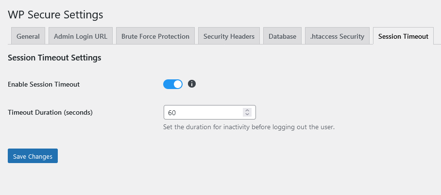

The **Session Timeout Settings** tab allows you to configure automatic logout for inactive users. This feature helps to improve security by ensuring that users who leave their sessions open for too long are automatically logged out.

### Enable Session Timeout
- **Description**: Automatically logs out inactive users after a specified period.
- **Advantages**:
  - Enhances security by preventing unauthorized access if a user forgets to log out.
  - Reduces the risk of session hijacking.
- **Disadvantages**:
  - May inconvenience users who take breaks without logging out.

:::tip[Pro Tip]
 Enable this feature on sites with sensitive information or in environments where multiple people have access to the same device.
:::

### Timeout Duration (seconds)
- **Description**: Sets the duration of inactivity before logging out the user.
- **Advantages**:
  - Provides control over how long a session can remain inactive before it is terminated.
  - Allows customization to balance security needs with user convenience.
- **Disadvantages**:
  - Setting the duration too short may frustrate users by logging them out too quickly.

:::tip[Pro Tip]
 Set a reasonable timeout duration that balances security and user convenience. A common setting is 900 seconds (15 minutes).
 :::

### Example Settings

- **Enable Session Timeout**: Yes
- **Timeout Duration (seconds)**: 900

:::danger[Warning]

- Ensure that you inform your users about the session timeout settings to prevent confusion or frustration.
- Test the timeout duration to ensure it works well with your site's workflow before implementing it widely.
:::

### How to Configure

1. Navigate to the **Session Timeout Settings** tab.
2. Check the **Enable Session Timeout** checkbox.
3. Set the **Timeout Duration** in seconds.
4. Click **Save Changes** to apply the settings.

