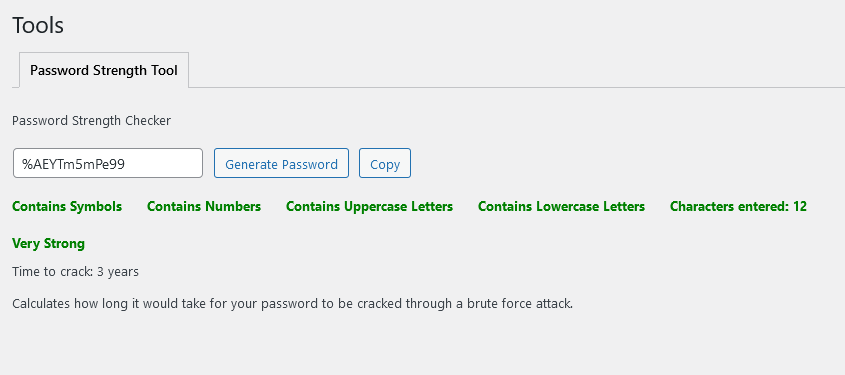

The **Tools** menu in **WP Secure** provides utilities to enhance the security of your WordPress site. One of the key features available under this menu is the **Password Strength Tool**. This tool helps you generate strong passwords and evaluate their strength against brute force attacks.

### Password Strength Tool

The **Password Strength Tool** allows users to generate secure passwords and check their strength. The tool includes the following features:

1. **Password Generation**: 
    - Users can generate a random password by clicking the **Generate Password** button.
    - The generated password will satisfy all the security criteria including the presence of symbols, numbers, uppercase letters, lowercase letters, and a length between 8 and 16 characters.

2. **Password Strength Meter**:
    - As users type or generate a password, the tool evaluates its strength using the zxcvbn library.
    - The strength meter displays the password strength as one of the following: **Weak**, **Fair**, **Good**, **Strong**, or **Very Strong**.
    - The meter updates in real-time as the password is being entered or generated.

3. **Criteria Check**:
    - The tool checks the password against several criteria:
        - **Contains Symbols**: Ensures the password includes special characters (e.g., !, @, #, $).
        - **Contains Numbers**: Ensures the password includes numerical digits (0-9).
        - **Contains Uppercase Letters**: Ensures the password includes uppercase alphabets (A-Z).
        - **Contains Lowercase Letters**: Ensures the password includes lowercase alphabets (a-z).
        - **Characters Entered**: Displays the number of characters entered, which should be between 8 and 16.
    - Each criterion is initially displayed in gray. As the password satisfies each criterion, the text changes to green, indicating compliance.

4. **Time to Crack**:
    - The tool estimates the time it would take for a brute force attack to crack the password and displays this information.
    - This helps users understand the effectiveness of their password in preventing unauthorized access.

5. **Copy Password**:
    - Users can copy the generated or entered password to the clipboard by clicking the **Copy** button.
    - An alert confirms that the password has been copied successfully.

### Example Usage

Here is a step-by-step guide on how to use the Password Strength Tool:

1. Navigate to the **Tools** menu under **WP Secure**.
2. In the **Password Strength Tool** section, you will see an input box where you can type your password or click the **Generate Password** button to create a strong password.
3. As you type or generate a password, the strength meter will display the password's strength.
4. The criteria list will update in real-time, showing which requirements the password meets.
5. The estimated time to crack the password will also be displayed.
6. Once you are satisfied with the password, click the **Copy** button to copy the password to the clipboard.

:::tip[Pro Tip]
Regularly update your passwords using this tool to ensure maximum security. Strong passwords significantly reduce the risk of unauthorized access to your WordPress site.
:::

:::danger[Warning]
Always store your passwords securely. Use a reliable password manager to keep track of your passwords and avoid writing them down or storing them in plain text.
:::

